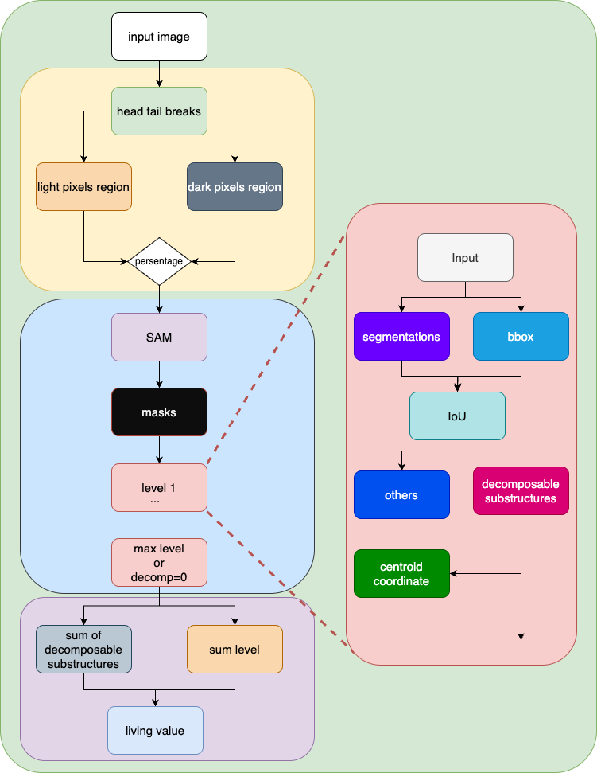
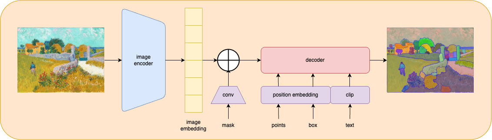

# This is a head/tail breaks application with SAM model
This project is inspired from Prof. Bin Jiang(HKUSTGZ) 
who is the author of Living Images: A Recursive Approach to Computing the Structural Beauty of Images or the Livingness of Space. If you are interested, PLZ refer [paper url](https://arxiv.org/abs/2301.01814) 
## Model pipeline


### SAM


## This project results

## Images living scores


## Reproduce of Living Images


## installation
```
pip install torch torchvision opencv-python matplotlib
```

```angular2html
git+https://github.com/facebookresearch/segment-anything.git
```